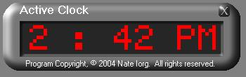

<div align="center">

## Clock with nice GUI effects


</div>

### Description

GUI (Graphical User Interface), Always-On-Top forms, Transparency with specified color, Clock
 
### More Info
 


<span>             |<span>
---                |---
**Submitted On**   |2004-04-08 14:11:04
**By**             |[Nate Iorg](https://github.com/Planet-Source-Code/PSCIndex/blob/master/ByAuthor/nate-iorg.md)
**Level**          |Intermediate
**User Rating**    |4.0 (12 globes from 3 users)
**Compatibility**  |VB 6\.0
**Category**       |[Graphics](https://github.com/Planet-Source-Code/PSCIndex/blob/master/ByCategory/graphics__1-46.md)
**World**          |[Visual Basic](https://github.com/Planet-Source-Code/PSCIndex/blob/master/ByWorld/visual-basic.md)
**Archive File**   |[Clock\_with173095482004\.zip](https://github.com/Planet-Source-Code/nate-iorg-clock-with-nice-gui-effects__1-52986/archive/master.zip)

### API Declarations

```
Private Declare Function SetWindowPos Lib "user32" ( _
 ByVal hwnd As Long, _
 ByVal hWndInsertAfter As Long, _
 ByVal X As Long, _
 ByVal Y As Long, _
 ByVal cx As Long, _
 ByVal cy As Long, _
 ByVal wFlags As Long _
) As Long
Private Declare Function ReleaseCapture Lib "user32" () As Long
Private Declare Function SendMessage Lib "user32" Alias "SendMessageA" _
   (ByVal hwnd As Long, ByVal wMsg As Long, ByVal wParam As Long, _
    lParam As Long) As Long
Private Declare Function SetLayeredWindowAttributes Lib "user32" (ByVal hwnd As Long, ByVal crKey As Long, ByVal bAlpha As Long, ByVal dwFlags As Long) As Long
Private Declare Function GetWindowLong Lib "user32" Alias "GetWindowLongA" (ByVal hwnd As Long, ByVal nIndex As Long) As Long
Private Declare Function SetWindowLong Lib "user32" Alias "SetWindowLongA" (ByVal hwnd As Long, ByVal nIndex As Long, ByVal dwNewLong As Long) As Long
Private Declare Function GetVersionEx Lib "kernel32" Alias "GetVersionExA" (lpVersionInformation As OSVERSIONINFO) As Long
Private Declare Function GetSysColor Lib "user32" (ByVal nIndex As Long) As Long
Private Declare Function GetParent Lib "user32" (ByVal hwnd As Long) As Long
Private Declare Function IsWindowVisible Lib "user32" (ByVal hwnd As Long) As Long
Public Declare Function FindWindow Lib "user32" Alias "FindWindowA" _
 (ByVal lpClassName As String, ByVal lpWindowName As String) As Long
```


